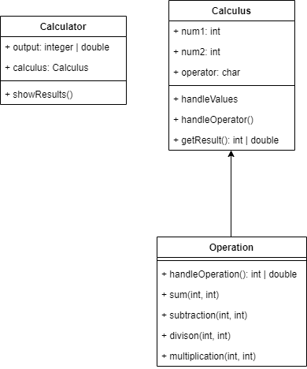

# Calculadora em PHP OOP
> Simples calculadora orientada a objetos usando regex.

## Uso

inicie pelo terminal/prompt com:
```
php main.php
```
Digite sua formula como uma string. Com ou sem espaços funciona. 
> Ex: 1+2 ou 1 * 10

## Diagrama UML



**OBS: Não está funcionando para mais do que uma operação por vez e o programa encerra após a operação.**
